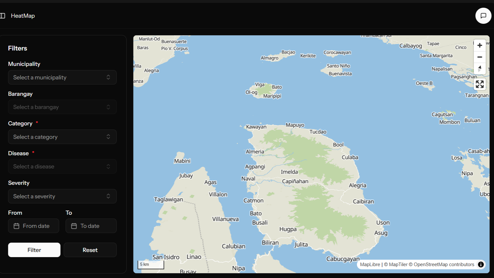

# GIS4Health

A geospatial health monitoring system for Biliran Province, Philippines. Built with Laravel, React (TypeScript), and MapLibre GL JS — visualizes disease case data as interactive heatmaps and 3D choropleth maps with smart filtering and an embedded AI assistant.



> Rebuilt and expanded version of the original [Heat Mapping of Various Health Cases in Biliran Province](https://github.com/kenneth-loto/heat-mapping-of-various-health-cases-in-biliran-province) project.

## Features

- **Heat Map** — Weighted disease density map with dynamic filters (municipality, barangay, disease category, severity, date range). Selecting a municipality or barangay zooms the map to that area automatically.
- **3D Choropleth Map** — Fill-extrusion barangay map where height and color encode case count. Time range selector (7 / 30 / 90 days) adjusts the color scale. Hover tooltips show barangay name and case count.
- **AI Assistant** — Embedded chat panel (OpenRouter) with a system prompt providing full context about GIS4Health and Biliran Province. Responds in plain language about the app's purpose and features. *(API key removed — disabled in current build.)*
- **Smart Map Transitions** — `fitBounds` via Turf.js for zoom-to-feature on filter changes; `flyTo` for animated resets.

## Tech Stack

| Layer | Technology |
|-------|-----------|
| Backend | Laravel |
| Frontend | React + TypeScript (Inertia.js) |
| Map Rendering | MapLibre GL JS |
| Map Tiles | MapTiler (basic-v2, streets-v2-light) |
| Geo Utilities | Turf.js (`@turf/bbox`, `@turf/helpers`) |
| UI Components | shadcn/ui |
| AI | OpenRouter (disabled) |

## Project Structure
```
├── app/
│   ├── Helpers/
│   │   └── ApiResponse.php
│   ├── Http/
│   │   ├── Controllers/
│   │   │   ├── Api/             # API controllers (heatmap, choropleth, CRUD)
│   │   │   ├── Auth/            # Authentication controllers
│   │   │   ├── Settings/        # Profile/password settings
│   │   │   └── ...Controllers   # Web controllers (Inertia)
│   │   ├── Middleware/
│   │   ├── Requests/            # Form validation requests
│   │   └── Resources/           # API resource transformers
│   ├── Models/                  # Eloquent models (10 models)
│   ├── Providers/
│   └── Support/
├── bootstrap/
├── config/                      # 13 config files
├── database/
│   ├── factories/
│   ├── migrations/              # 16 migration files
│   └── seeders/                 # Seeders + data/
├── public/
│   └── build/                   # Vite build output
├── resources/
│   ├── css/
│   │   └── app.css
│   ├── js/
│   │   ├── api/                 # API client functions
│   │   ├── components/
│   │   │   ├── CustomComponents/ # ChatBot, Combobox, DataTable, Form, etc.
│   │   │   └── ui/              # shadcn/ui primitives (32 components)
│   │   ├── data/                # Static data (knowledge.json)
│   │   ├── hooks/               # Custom React hooks (23 hooks)
│   │   ├── layouts/             # App, auth, settings layouts
│   │   ├── lib/                 # Utility library
│   │   ├── pages/               # Inertia page components
│   │   │   ├── HeatMap/         # Heatmap page
│   │   │   ├── Choropleth/      # 3D choropleth page
│   │   │   ├── HealthCase/      # Health case management
│   │   │   ├── Barangay/        # Barangay management
│   │   │   ├── PatientInfo/     # Patient information
│   │   │   ├── Utilities/       # Category, Disease, Municipality, Severity, Suffix
│   │   │   ├── ActivityLog/     # Activity log viewer
│   │   │   ├── settings/        # Appearance, password, profile
│   │   │   └── auth/            # Login, register, password reset, etc.
│   │   ├── types/               # TypeScript type definitions
│   │   ├── utils/               # API utils, map controls
│   │   ├── app.tsx
│   │   └── ssr.tsx
│   └── views/
│       └── app.blade.php
├── routes/
│   ├── api.php
│   ├── auth.php
│   ├── console.php
│   ├── settings.php
│   └── web.php
├── storage/
└── tests/
    ├── Feature/
    └── Unit/
```
## Setup

### Prerequisites

- PHP 8.2+
- Composer
- Node.js 18+
- MySQL 8+ / MariaDB 10.6+
- MapTiler API key
- OpenRouter API key *(optional — AI assistant)*

### Installation

1. **Clone the repository**

```bash
git clone <repo-url>
cd gis4health
```

2. **Install PHP dependencies**

```bash
composer install
```

3. **Install JS dependencies**

```bash
npm install
```

4. **Environment setup**

```bash
cp .env.example .env
php artisan key:generate
```

Update `.env`:

```env
DB_DATABASE=gis4health
DB_USERNAME=root
DB_PASSWORD=

MAPTILER_API_KEY=your_maptiler_key

# Optional — enables AI assistant
OPENROUTER_API_KEY=your_openrouter_key
```

5. **Database setup**

```bash
php artisan migrate
php artisan db:seed  # optional sample data
```

6. **Build assets**

```bash
npm run dev       # development
npm run build     # production
```

7. **Serve**

```bash
php artisan serve
```

## Map Details

Both maps are centered on **Naval, Biliran** (`[124.4761, 11.6433]`) with bounds clamped to ±0.5° to prevent panning off-province.

**Heatmap** — Uses MapTiler `basic-v2` style. Transitions from `heatmap` layer at province level to `circle` markers at zoom 12+. Intensity and radius interpolate with zoom.

**Choropleth** — Uses MapTiler `streets-v2-light` style. `fill-extrusion` height = `value × 100` meters. Color scale max adjusts per time range: 10 (7-day), 50 (30-day), 100 (90-day).

## AI Assistant

The assistant uses OpenRouter with a static system prompt describing GIS4Health, its features, and its public health context. In the current build, it does not query live database values — responses are context-only. To enable, add an `OPENROUTER_API_KEY` to `.env`.

Future development: feed live case summaries into the prompt so the assistant can answer data-specific questions (e.g., "which barangay had the most dengue cases this week").

## License

MIT — see [LICENSE](LICENSE).


